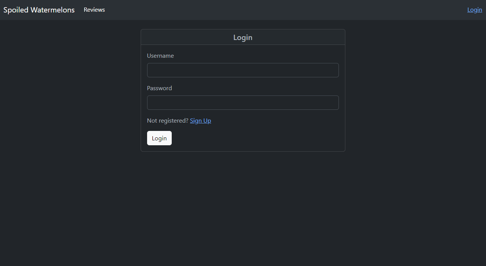

## SPOILED WATERMELONS

    
## Table of Contents
* [Description](#description)
* [Built-With](#built-with)
* [Demo](#demo)
* [Installation](#installation)
* [Usage](#usage)
* [Collaborators](#collaborators)
* [Questions](#questions)
* [License](#license)

## Description
    
This is a dynamic full-stack web application that allows a user to view movies stored within a MYSQL database, leave a review and store a user's input, as well as view all the reviews left by other users.

## Built-With

  
  
  
  
  
  
  
  
  

## Demo

You can view the live deployed application at Heroku by clicking the following link:
[Spoiled Watermelons](https://spoiled-watermelons.herokuapp.com/)

The following images display the web application's appearance, functionality, and responsiveness:

 Homepage

Login Page

Signup Page

Reviews Page

Tablet View

Mobile View

## Installation

There is no installation required for this website.

## Usage

A user will first be routed to the login page when accessing the website. Once there, a user may either log in or click signup in order to access the full website. After signing in, a user will then be redirected to the homepage where they will be able to view all the movies in the database, a movie's average rating and click on 'Leave a Review' to be taken to a page where they can leave a review for a specific movie. A user can also click on the Reviews tab to be taken to a page where they can view all the reviews left by other users. 

## Collaborators

Mdelmain  
 
Seropyan1995  
 
Gpaul12  
 
Cpalacios95  
 

## Questions

If there are additional questions, please reach out to us here: 

* GitHub: https://github.com/mdelmain
* GitHub: https://github.com/gpaul12
* GitHub: https://github.com/Seropyan1995
* GitHub: https://github.com/Carolinapalacios95

## License
        
    MIT
